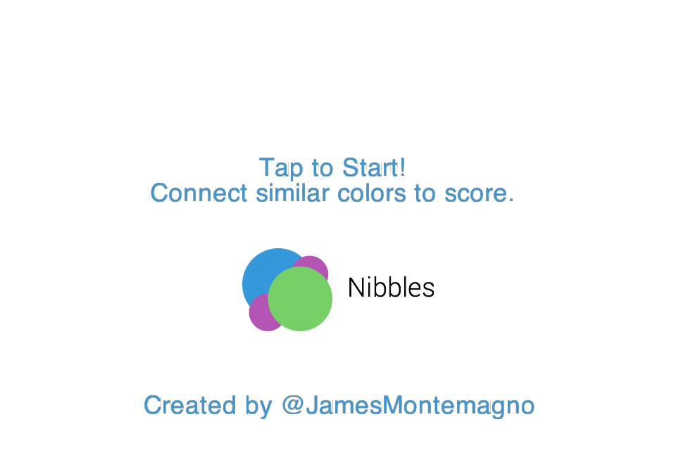
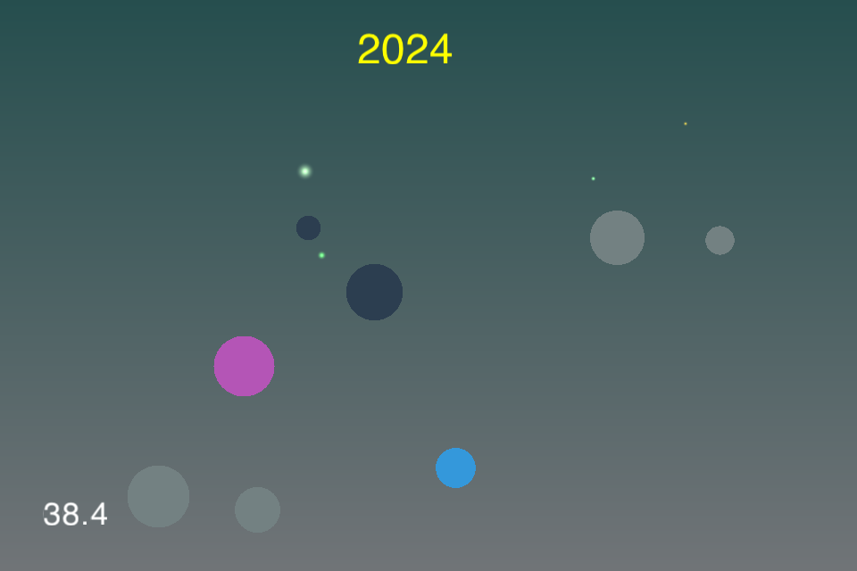

Nibbles - Don’t bite off more than you can chew (a CocosSharp Game)
=========================

A simple [CocosSharp](http://www.github.com/mono/cocosharp) game built by a UAT Game Jam in November in under 12 hours.

Theme of Game Jam was **connections**.

### How to play
Simply connect colored bubbles together. Connect multiple at the same time to increase your multiplier. The larger the bubble the more points it is worth, but don’t let it pop!

### Screenshots

 

### Development by:
- James Montemagno: [Twitter](http://www.twitter.com/jamesmontemagno) | [Blog](http://motzcod.es) | [GitHub](http://www.github.com/jamesmontemagno)

### Music was purchased and licensed from Audio Jungle and can not be re-used under the MIT license
